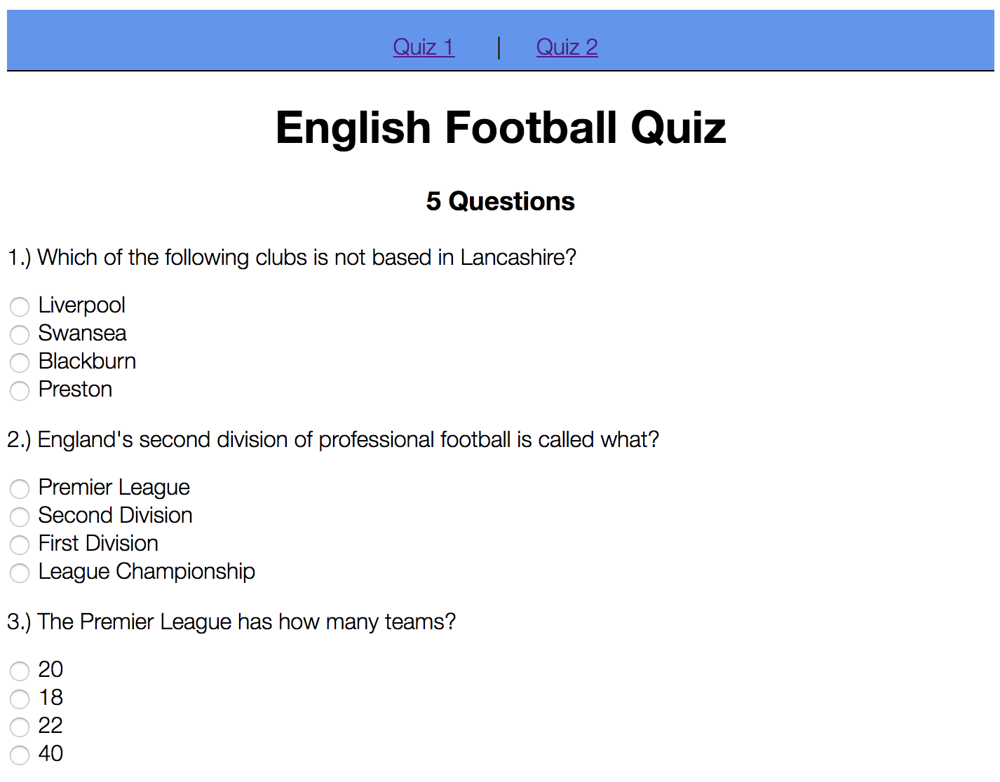

<h1>English Football Quiz</h1>

This Java web application can be used to give short quizzes which can be loaded from any text file. The default quiz is about English Football, seeing as I know so much about it.
 :wink:
 
 

 The code consists of a simple Java back-end server which provides a REST API using Jackson to the AngularJS front-end client. All the code is bundled into a WAR file and can be served from an Apache Tomcat Server

 
 

Try it out <a href="https://java-angular-football-quiz.herokuapp.com">here</a>

 

